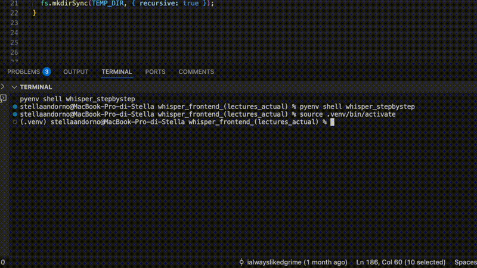

#  🎙️ Whisper Transcription Demo

A clean, modern web app that brings OpenAI Whisper (via Hugging Face Transformers) to a user-friendly interface.

[Demo video download](./media/demo_transcription_app.mp4)

⸻
### Why I built this

I wanted to streamline my study workflow: instead of running Python scripts for every lecture or research video, I now use this user-friendly tool daily. The app wraps local Whisper execution in a clean web interface with proper file handling and progress tracking.
Current architecture: Next.js frontend that spawns Python subprocesses locally for AI inference.

	•	Frontend: Next.js app with real-time progress, robust error handling, and a responsive UI.

	•	"""Backend""": Python executes Whisper through transformers (local inference), handling YouTube URLs, file uploads, and live mic recording.

I’m currently scaling from local execution to cloud deployment and using this project to learn full-stack development, model serving, auth, Stripe payments, and production ML pipelines—bridging the gap between ML models and real user applications.

⸻

## Current Features
	•	YouTube URL Processing → extract & transcribe audio from educational videos
	•	Multi-format Uploads → MP3, WAV, M4A
	•	Live Recording → mic capture & instant transcription
	•	Real-time Progress → visual feedback during AI processing
	•	Responsive UI/UX → clean interface across devices

## Technical Stack

Frontend

    •   Next.js 14 - Modern React framework with App Router
    •   TypeScript - Type-safe development
    •   Tailwind CSS - Utility-first styling for responsive design
    •   React Hooks - State management and side effects

Local AI Processing

	•	Node.js (API routes / orchestration)
	•	Python 3.9+ (model execution)
	•	Hugging Face Transformers (OpenAI Whisper model implementation)
	•	PyTorch (Deep learning framework for model inference)

Integration Layer

    •   Node.js child processes - Spawns Python scripts
    •   Inter-process communication - Streams progress/results
    •   Temporary file management - Upload handling & cleanup
    •   Error handling - Robust subprocess lifecycle management

Processing Pipeline
	•	yt-dlp → YouTube audio extraction
	•	FFmpeg → audio conversion & preprocessing
	•	Child process IPC → Node.js ↔ Python communication
	•	File system → temp files & cleanup

Dev Tools
	•	Git with structured commits

⸻

🏗️ Architecture

    Frontend (Next.js)
    └─▶ API Routes (Node.js)

            └─▶ Python Subprocess

                └─▶ Hugging Face Whisper (PyTorch)

                        └─▶ Transcription Results → Frontend

	1.	User Interaction Layer — Next.js manages uploads, YouTube links, recording, UI state
	2.	API Layer — validates requests, handles temp files & job lifecycle
	3.	AI Layer — Python runs Whisper via transformers for local inference
	4.	Comms Layer — IPC streams logs/progress back to the UI
	5.	Response Layer — formatted transcripts returned to the client

⸻

## Current Learning & Development Roadmap

I am currently having fun in learning modern web development through this project. I am actively expanding this prototype into a production-ready SaaS application, using it as my hands-on learning vehicle for modern web development. 

I am currently working on and learning:

	•	Cloud deployment & model serving
	•	User authentication & roles
	•	Database integration (jobs, transcripts, usage)
	•	Stripe for subscriptions/payments
	•	LLM-powered features (summarization, highlights, Q&A)
	•	Observability (logging, metrics, tracing)
	•	Production hardening (rate limits, queues, retries)

⸻

 My goal is to understand every layer of the stack, from ML model optimization to user experience design.

